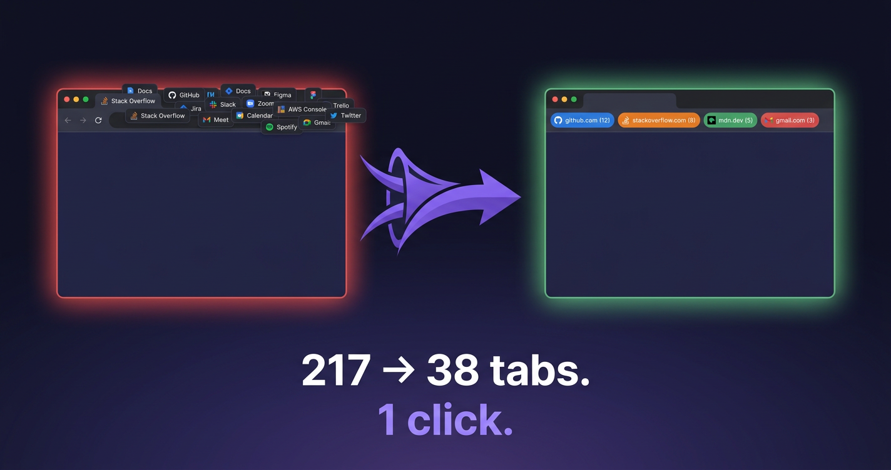

# Tab Vacuum

> **One click — remove duplicate tabs across all Chrome windows and group what's left by website.**

[](#install)
[](LICENSE)
[](background.js)



Drowning in 4 windows × 80 tabs, half of them duplicates of the same Stack Overflow page? Tab Vacuum is a 1-click fix.

## What it does

Click the toolbar icon and instantly:

1. **Removes every duplicate tab** across all your Chrome windows (matched by URL)
2. **Merges the survivors** into one window
3. **Groups the result by website** (collapsed, so you only see hostnames)

That's it. ~50 lines of code. No accounts, no settings, no tracking.

## Install

- **From Chrome Web Store:** [link coming soon]
- **From source (developer mode):**
  1. Clone this repo: `git clone https://github.com/mayhsundar/tab-vacuum.git`
  2. Open `chrome://extensions`
  3. Enable **Developer mode** (top right)
  4. Click **Load unpacked** → select this folder
  5. Pin the Tab Vacuum icon to your toolbar

## Why it's different

| | Tab Vacuum | OneTab | Workona | Toby |
|---|---|---|---|---|
| Removes duplicates across windows | ✅ | ❌ | ❌ | ❌ |
| Groups remaining tabs by site | ✅ | ❌ | Manual | Manual |
| Works in 1 click | ✅ | ❌ | ❌ | ❌ |
| Free, no account | ✅ | ✅ | ❌ | ❌ |
| Code is auditable | ✅ (50 lines) | ❌ | ❌ | ❌ |
| Sends data anywhere | ❌ Never | ❌ | ✅ Cloud sync | ✅ Cloud sync |

## How it works (the whole source)

```js
chrome.action.onClicked.addListener(async (tab) => {
  const tabs = await chrome.tabs.query({});
  const seen = new Map();
  const dupes = [];
  for (const t of tabs) {
    if (seen.has(t.url)) dupes.push(t.id);
    else seen.set(t.url, t.id);
  }
  if (dupes.length) await chrome.tabs.remove(dupes);

  const keep = await chrome.tabs.query({});
  const moveIds = keep.filter((t) => t.windowId !== tab.windowId).map((t) => t.id);
  if (moveIds.length) await chrome.tabs.move(moveIds, { windowId: tab.windowId, index: -1 });

  const all = await chrome.tabs.query({ windowId: tab.windowId });
  const byHost = new Map();
  for (const t of all) {
    let host;
    try { host = new URL(t.url).hostname; } catch { continue; }
    if (!host) continue;
    if (!byHost.has(host)) byHost.set(host, []);
    byHost.get(host).push(t.id);
  }
  for (const [host, ids] of byHost) {
    if (ids.length < 2) continue;
    const groupId = await chrome.tabs.group({ tabIds: ids, createProperties: { windowId: tab.windowId } });
    await chrome.tabGroups.update(groupId, { title: host, collapsed: true });
  }
});
```

That's the whole extension. Nothing hidden. [See manifest.json](manifest.json).

## Privacy

Tab Vacuum reads tab URLs **only when you click the icon**, **only on your device**, and **never sends anything anywhere**. There's no server. Full policy: [PRIVACY.md](PRIVACY.md).

## FAQ

**Q: How do I remove duplicate tabs in Chrome?**
Install Tab Vacuum, click the toolbar icon. Done.

**Q: Does it work across multiple Chrome windows?**
Yes — that's the whole point. It dedupes across all open windows, then merges survivors into the window where you clicked.

**Q: Will it close pinned tabs?**
Pinned tabs are kept; only duplicates of pinned tabs (in other windows) are removed.

**Q: What happens to tabs without a URL (loading, blank)?**
Tabs with empty/blank URLs are treated as distinct and kept.

**Q: Does it sync, save, or back up my tabs?**
No. It does not store anything. If you want session backup, use Chrome's built-in History or a session manager.

**Q: Why so simple? Will you add features?**
The simplicity is the feature. Anything you add (filters, exceptions, sync) makes it slower and scarier. The 50-line version is intentional.

**Q: Is it really free?**
Yes — free forever, no ads, no premium tier, no upsell. Code is MIT-licensed.

**Q: How do I group tabs by website manually?**
You don't need to — Tab Vacuum does it for you, by hostname, every click.

## Contributing

Issues and PRs welcome. Keep the spirit: **minimal code, no dependencies, no settings UI unless absolutely necessary**.

## License

[MIT](LICENSE) — do whatever you want.

---

If Tab Vacuum saved you from tab purgatory, a ⭐ on this repo and a review on the Chrome Web Store goes a long way.
